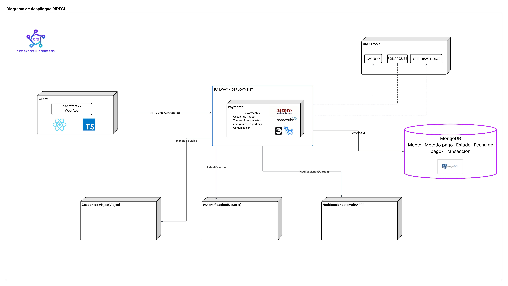
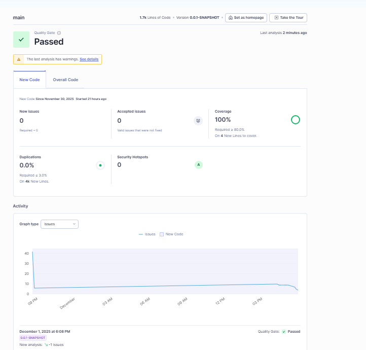

# 💳 Poseidon - Payments Management Backend

This module is designed to manage all financial operations within RidECI. It handles the registration, processing, and querying of payments made by passengers to drivers or the platform, whether through digital methods (Nequi, cards) or cash. Additionally, it controls transactions, payment statuses, refunds, receipts, and reconciliation, ensuring security, traceability, and integrity of the system's financial information.

## 👥 Developers

- Deisy Lorena Guzman Cabrales
- Diego Fernando Chavarro Castillo
- Oscar Andres Sanchez Porras
- Samuel Leonardo Albarrachin Vergara
- Sergio Alejandro Idarraga

## 📑 Content Table

1. [Project Architecture](#-project-architecture)
    - [Hexagonal Structure](#-clean---hexagonal-structure)
2. [API Documentation](#-api-endpoints)
    - [Endpoints](#-api-endpoints)
3. [Input & Output Data](#input-and-output-data)
4. [Microservices Integration](#-connections-with-other-microservices)
5. [Technologies](#technologies)
6. [Branch Strategy](#-branches-strategy--structure)
7. [System Architecture & Design](#-system-architecture--design)
8. [Getting Started](#-getting-started)
9. [Testing](#-testing)

---

## 🏛️ Project Architecture

The Poseidon - Payments Management Backend follows a decoupled hexagonal - clean architecture that seeks to isolate business logic from other parts of the app by dividing it into multiple components:

* **🧠 Domain (Core)**: Contains the business logic and principal rules.
* **🎯 Ports (Interfaces)**: Interfaces that define the actions the domain can perform.
* **🔌 Adapters (Infrastructure)**: Implementations of the ports that connect the domain with specific technologies.

The use of this architecture provides the following benefits:

* ✅ **Separation of Concerns:** Distinct boundaries between logic and infrastructure.
* ✅ **Maintainability:** Easier to update or replace specific components.
* ✅ **Scalability:** Components can evolve independently.
* ✅ **Testability:** The domain can be tested in isolation without a database or server.

## 📂 Clean - Hexagonal Structure

```
📂 poseidon_payments_backend
┣ 📂 src/
┃ ┣ 📂 main/
┃ ┃ ┣ 📂 java/
┃ ┃ ┃ ┗ 📂 edu/dosw/rideci/
┃ ┃ ┃   ┣ 📄 PoseidonPaymentsApplication.java
┃ ┃ ┃   ┣ 📂 domain/
┃ ┃ ┃   ┃ ┗ 📂 model/            # 🧠 Domain models
┃ ┃ ┃   ┃   ┣ 📂 enums/
┃ ┃ ┃   ┃   ┗ 📂 valueobjects/
┃ ┃ ┃   ┣ 📂 application/
┃ ┃ ┃   ┃ ┣ 📂 port/
┃ ┃ ┃   ┃ ┃ ┣ 📂 in/             # 🎯 Input ports (use cases)
┃ ┃ ┃   ┃ ┃ ┗ 📂 out/            # 🔌 Output ports (repositories)
┃ ┃ ┃   ┃ ┗ 📂 service/          # ⚙️ Use case implementations
┃ ┃ ┃   ┣ 📂 infrastructure/
┃ ┃ ┃   ┃ ┣ 📂 adapters/
┃ ┃ ┃   ┃ ┃ ┣ 📂 messaging/      # 📨 RabbitMQ listeners/publishers
┃ ┃ ┃   ┃ ┃ ┗ 📂 persistence/    # 🗄️ Database adapters
┃ ┃ ┃   ┃ ┣ 📂 config/           # ⚙️ Spring configurations
┃ ┃ ┃   ┃ ┣ 📂 controller/       # 🌐 REST controllers
┃ ┃ ┃   ┃ ┃ ┗ 📂 dto/
┃ ┃ ┃   ┃ ┃   ┣ 📂 Request/
┃ ┃ ┃   ┃ ┃   ┗ 📂 Response/
┃ ┃ ┃   ┃ ┗ 📂 persistence/
┃ ┃ ┃   ┃   ┣ 📂 Entity/
┃ ┃ ┃   ┃   ┗ 📂 Repository/
┃ ┃ ┃   ┃     ┗ 📂 mapper/
┃ ┃ ┗ 📂 resources/
┃ ┃   ┣ 📄 application.properties
┃ ┃   ┗ 📄 schema.sql
┣ 📂 test/
┃ ┣ 📂 java/
┃ ┃ ┗ 📂 edu/dosw/rideci/
┃ ┃   ┣ 📄 PoseidonPaymentsApplicationTests.java
┃ ┃   ┗ 📂 unit/
┃ ┃     ┣ 📂 controller/
┃ ┃     ┗ 📂 usecases/
┣ 📂 docs/
┃ ┣ 📂 imagenes/
┃ ┣ 📂 uml/
┃ ┗ 📂 pdf/
┣ 📄 pom.xml
┣ 📄 docker-compose.yml
┣ 📄 Dockerfile
┗ 📄 README.md
```

---

# 📡 API Endpoints

For detailed documentation, refer to our Swagger UI (running locally at http://localhost:8081/swagger-ui.html).

## Payment Management

| Method | URI | Description | Request Body / Params |
| :--- | :--- | :--- | :--- |
| `POST` | `/api/payments/create` | Creates a new payment transaction. | `{ "userId": ..., "tripId": ..., "amount": ..., "paymentMethod": ... }` |
| `GET` | `/api/payments/{id}` | Retrieves payment details by ID. | `id` (Path Variable) |
| `GET` | `/api/payments/{id}/status` | Gets payment status by ID. | `id` (Path Variable) |
| `GET` | `/api/payments/user/{id}` | Gets all payments for a specific user. | `id` (Path Variable) |
| `GET` | `/api/payments/trips/{id}` | Gets all payments for a specific trip. | `id` (Path Variable) |
| `GET` | `/api/payments/history` | Retrieves complete payment history. | None |
| `GET` | `/api/payments/date` | Gets payments filtered by date range. | `startDate`, `endDate` (Query Params) |
| `GET` | `/api/payments/active` | Gets all active payments. | None |
| `PUT` | `/api/payments/{id}` | Updates a payment transaction. | `id` (Path Variable) + Request Body |
| `PATCH` | `/api/payments/{id}/authorize` | Authorizes a pending payment. | `id` (Path Variable) |
| `PATCH` | `/api/payments/{id}/approve` | Approves an authorized payment. | `id` (Path Variable) |
| `PATCH` | `/api/payments/{id}/complete` | Completes an approved payment. | `id` (Path Variable) |
| `PATCH` | `/api/payments/{id}/cancel` | Cancels a payment transaction. | `id` (Path Variable) |
| `DELETE` | `/api/payments/{id}` | Deletes a payment by ID. | `id` (Path Variable) |

## Refund Management

| Method | URI | Description | Request Body / Params |
| :--- | :--- | :--- | :--- |
| `PATCH` | `/api/payments/{id}/refund` | Initiates a refund for a payment. | `id` (Path Variable) + `{ "amount": ..., "reason": ... }` |
| `GET` | `/api/payments/{id}/refund` | Retrieves refund details by payment ID. | `id` (Path Variable) |
| `GET` | `/api/payments/{id}/refund/status` | Gets refund status by payment ID. | `id` (Path Variable) |
| `GET` | `/api/payments/refunds` | Retrieves all refunds. | None |
| `PATCH` | `/api/payments/{id}/refund/cancel` | Cancels a pending refund. | `id` (Path Variable) |
| `DELETE` | `/api/payments/{id}/refund` | Deletes a refund by payment ID. | `id` (Path Variable) |

## Refund Workflow

| Method | URI | Description | Request Body / Params |
| :--- | :--- | :--- | :--- |
| `PATCH` | `/api/payments/{id}/refund/authorize` | Authorizes a refund request. | `id` (Path Variable) |
| `PATCH` | `/api/payments/{id}/refund/approve` | Approves an authorized refund. | `id` (Path Variable) |
| `PATCH` | `/api/payments/{id}/refund/complete` | Completes an approved refund. | `id` (Path Variable) |

## Payment Methods Management

| Method | URI | Description | Request Body / Params |
| :--- | :--- | :--- | :--- |
| `POST` | `/api/payment-methods` | Creates a new payment method. | `{ "userId": ..., "type": ..., "details": ... }` |
| `GET` | `/api/payment-methods` | Gets all payment methods. | None |
| `GET` | `/api/payment-methods/{id}` | Gets payment method by ID. | `id` (Path Variable) |
| `DELETE` | `/api/payment-methods/{id}` | Deletes a payment method. | `id` (Path Variable) |

## Bre-B Keys Management

| Method | URI | Description | Request Body / Params |
| :--- | :--- | :--- | :--- |
| `POST` | `/api/breb-keys` | Creates a new Bre-B key. | `{ "userId": ..., "keyNumber": ..., "alias": ... }` |
| `GET` | `/api/breb-keys` | Gets all Bre-B keys. | None |
| `GET` | `/api/breb-keys/{id}` | Gets Bre-B key by ID. | `id` (Path Variable) |
| `PATCH` | `/api/breb-keys/{id}/default` | Sets a Bre-B key as default. | `id` (Path Variable) |
| `DELETE` | `/api/breb-keys/{id}` | Deletes a Bre-B key. | `id` (Path Variable) |

## Credit Cards Management

| Method | URI | Description | Request Body / Params |
| :--- | :--- | :--- | :--- |
| `POST` | `/api/credit-cards` | Registers a new credit card. | `{ "userId": ..., "cardNumber": ..., "cvv": ..., "expiryDate": ... }` |
| `GET` | `/api/credit-cards` | Gets all registered credit cards. | None |
| `GET` | `/api/credit-cards/{id}` | Gets credit card by ID. | `id` (Path Variable) |
| `PATCH` | `/api/credit-cards/{id}/default` | Sets a credit card as default. | `id` (Path Variable) |
| `DELETE` | `/api/credit-cards/{id}` | Deletes a credit card. | `id` (Path Variable) |

## Audit & Administration

| Method | URI | Description | Request Body / Params |
| :--- | :--- | :--- | :--- |
| `GET` | `/api/admin/payments/audit` | Gets all audit logs. | None |
| `GET` | `/api/admin/payments/audit/{id}` | Gets audit log by ID. | `id` (Path Variable) |
| `POST` | `/api/admin/payments/suspend` | Creates a payment suspension. | `{ "userId": ..., "reason": ..., "duration": ... }` |
| `DELETE` | `/api/admin/payments/suspend/{id}` | Removes a payment suspension. | `id` (Path Variable) |

## Internal & Webhooks

| Method | URI | Description | Request Body / Params |
| :--- | :--- | :--- | :--- |
| `POST` | `/api/payments/internal/trip/{tripId}/complete` | Internal endpoint to complete trip payments. | `tripId` (Path Variable) |
| `POST` | `/api/payments/internal/trip/{tripId}/cancel` | Internal endpoint to cancel trip payments. | `tripId` (Path Variable) |
| `POST` | `/api/payments/webhooks/nequi` | Webhook for Nequi payment notifications. | Nequi webhook payload |
| `POST` | `/api/payments/webhooks/success` | Generic success webhook handler. | Webhook payload |
| `POST` | `/api/payments/webhooks/failure` | Generic failure webhook handler. | Webhook payload |

### 📄 HTTP Status Codes

Common status codes returned by the API.

| Code | Status | Description |
| :--- | :--- | :--- |
| `200` | **OK** | Request processed successfully. |
| `201` | **Created** | Payment or refund created successfully. |
| `400` | **Bad Request** | Invalid payment data or missing parameters. |
| `401` | **Unauthorized** | Missing or invalid JWT token. |
| `404` | **Not Found** | Payment, refund, or transaction ID does not exist. |
| `409` | **Conflict** | Duplicate payment or invalid state transition. |
| `500` | **Internal Server Error** | Unexpected error (e.g., payment gateway failure). |

---

# Input and Output Data

### Payment Creation

**Input:**
```json
{
  "id": "tx_12345",
  "bookingId": "booking_789",
  "passengerId": "user_456",
  "amount": 25.50,
  "paymentMethod": "NEQUI",
  "extra": "Trip from Centro to Norte",
  "receiptCode": "REC-2025-001"
}
```

**Output:**
```json
{
  "id": "tx_12345",
  "bookingId": "booking_789",
  "passengerId": "user_456",
  "amount": 25.50,
  "status": "PENDING",
  "receiptCode": "REC-2025-001",
  "errorMessage": null,
  "paymentMethod": "NEQUI",
  "extra": "Trip from Centro to Norte",
  "createdAt": "2025-12-05T10:30:00"
}
```

### Refund Initiation

**Input:**
```json
{
  "amount": 25.50,
  "reason": "Trip cancelled by driver"
}
```

**Output:**
```json
{
  "id": "ref_xyz789",
  "transactionId": "tx_12345",
  "bookingId": "booking_789",
  "passengerId": "user_456",
  "refundedAmount": 25.50,
  "status": "PENDING",
  "reason": "Trip cancelled by driver",
  "requestAt": "2025-12-05T11:00:00"
}
```

---

# 🔗 Connections with other Microservices

This module does not work alone. It interacts with the RidECI Ecosystem via REST APIs and Message Brokers (RabbitMQ):

## 📨 Events Published (via RabbitMQ)

**Exchange:** `payment.exchange`

| Routing Key | Event | Description |
| :--- | :--- | :--- |
| `payment.completed` | Payment Completed | Published when a payment is successfully processed. |
| `payment.failed` | Payment Failed | Published when a payment processing fails. |
| `refund.completed` | Refund Completed | Published when a refund is successfully processed. |

**Event Structure:**
```json
{
  "paymentId": "tx_12345",
  "userId": "user_456",
  "driverId": "driver_789",
  "tripId": "booking_xyz",
  "status": "COMPLETED",
  "amount": 25.50,
  "timestamp": "2025-12-05T10:30:00Z"
}
```

## 📥 Events Consumed (via RabbitMQ)

### From Travel Management Module

**Exchange:** `travel.exchange`

| Routing Key | Event | Description |
| :--- | :--- | :--- |
| `travel.created` | Trip Created | Notifies when a new trip is created. |
| `travel.updated` | Trip Updated | Triggers payment completion when status="COMPLETED". |
| `travel.cancelled` | Trip Cancelled | Triggers refund process if payment was made. |

**Travel Updated Event Structure:**
```json
{
  "travelId": "trip_xyz",
  "userId": "user_456",
  "driverId": "driver_789",
  "currentLocation": {
    "latitude": 4.7110,
    "longitude": -74.0721
  },
  "status": "COMPLETED",
  "updatedAt": "2025-12-05T10:30:00",
  "finalFare": 25.50
}
```

### From Authentication Module

**Exchange:** `user.exchange`

| Routing Key | Event | Description |
| :--- | :--- | :--- |
| `auth.user.*` | User Events | Validates user status (ACTIVE, BLOCKED, DELETED) before processing payments. |

**User Event Structure:**
```json
{
  "id": "event_123",
  "userId": 456,
  "name": "John Doe",
  "email": "john@example.com",
  "state": "ACTIVE",
  "role": "PASSENGER",
  "timestamp": "2025-12-05T10:00:00Z"
}
```

---

# Technologies

The following technologies were used to build and deploy this module:

### Backend & Core


### Database

 (Testing)

### Message Broker


### DevOps & Infrastructure


### CI/CD & Quality Assurance


### Documentation & Testing


### Communication & Project Management


---

# 🌿 Branches Strategy & Structure

This module follows a strict branching strategy based on Gitflow to ensure ordered versioning, code quality, and continuous integration.

```
- hotfix/fix-token-expiration
- hotfix/security-patch
```

---

### 📝 Commit Conventions

Commits follow the **Conventional Commits** format to maintain a clear and traceable history:

#### **Standard Format**

```
[jira-code] [type]: [brief description of the action]
```

**Examples:**

```
45-feat: add JWT token validation
46-fix: fix role-based authentication error
```

---

#### **Commit Types**

| **Type** | **Description** | **Example** |
| :--- | :--- | :--- |
| `feat` | New feature | `22-feat: implement JWT authentication` |
| `fix` | Bug fix | `24-fix: fix login endpoint error` |
| `docs` | Documentation changes | `25-docs: update README with new routes` |
| `refactor` | Code refactoring without functional changes | `27-refactor: optimize security service` |
| `test` | Unit or integration tests | `29-test: add tests for AuthService` |
| `chore` | Maintenance or configuration | `30-chore: update Maven dependencies` |


**Rules:**

* One commit = one complete action
* Maximum **72 characters** per line
* Use imperative mood ("add", "fix", etc.)
* Clear description of what and where
* Small and frequent commits

---

## 📐 System Architecture & Design

### 🏗️ Clean Architecture - Layer Organization

The **Payment Module** follows **Clean Architecture** principles, maintaining business logic independent from frameworks and technical implementation details. This facilitates testing, updates, and agile deployments.

#### **DOMAIN (Domain Layer)**
Represents the **business core**, defining **what the system does, not how it does it**.  
Includes entities, value objects, enumerations, repository interfaces, and business services.

#### **APPLICATION (Application Layer)**
Orchestrates business logic through **use cases**, **DTOs**, **mappers**, and **custom exceptions**.  
Coordinates domain operations without depending on external infrastructure.

#### **INFRASTRUCTURE (Infrastructure Layer)**
Implements **technical details**: REST controllers, persistence, configuration, security, and external service integration.  
All dependencies point inward, following the Dependency Inversion Principle.

---

### 📊 Deployment Diagram



#### **Backend and Deployment**
- Built with Java and Spring Boot
- Automatically deployed to Railway via CI/CD pipeline with GitHub Actions
- Dockerized containers for consistent environment across development and production

#### **PostgreSQL Storage**

The Payment microservice uses **PostgreSQL** as the primary database to store critical information related to financial operations.  

**Stored Data:**
1. **Payment Transactions** - Complete payment lifecycle records
2. **Refunds** - Refund requests and processing details
3. **Audit & Events** - Immutable logs for traceability
4. **Associated Payment Methods** - Saved user payment methods
5. **Trip & Booking Relations** - Links payments to travel services

PostgreSQL ensures **consistency, referential integrity, and traceability**, essential for secure financial operations within the RidECI platform.

#### **Code Quality**
- Integrates **JaCoCo** to measure test coverage
- Uses **SonarQube** for static analysis and vulnerability detection

---

## 🎯 Main Functionalities - Payment Module

- ✅ **Payment Management** - Process payments via Nequi, Cards, Cash, and Bre-B Keys
- 💰 **Refund Management** - Handle refund requests with complete workflow
- 📊 **Query & Audit** - Retrieve payment history and generate digital receipts
- 🔒 **Security & Validation** - Prevent duplicate transactions and ensure data integrity

---

### 🏛️ General Component Diagram


#### **Frontend**
Developed in TypeScript and deployed on Vercel for fast, responsive user experience.

#### **API Gateway**
Centralizes and manages communication between all system components, handling routing, authentication, and load balancing.

#### **Backend - Payment Module**
Manages payment logic, integrating JaCoCo and SonarQube to ensure code quality and correct functionality for drivers, trips, and users.

Uses a CI/CD pipeline to validate everything works as expected before deployment.

Deployed on Railway to build Docker containers. Uses Swagger and Postman for testing, and Spring Boot to efficiently manage the project through a flexible REST API.

#### **Database**
Uses PostgreSQL to store institutional and transactional data with full ACID compliance.


---

### 🔧 Specific Component Diagram - Hexagonal Architecture


The Payment module uses **Hexagonal Architecture** to maintain business logic independent from frameworks and technical details. This facilitates testing, updates, and agile deployments.

#### **Structure and Flow**
The frontend (React + TypeScript) calls controllers that invoke use cases. Use cases contain the core logic: payment processing, refund management, and transaction auditing. Use cases only depend on ports, keeping the core isolated.

#### **Ports and Adapters**
Ports define contracts for persistence, event publishing, and notifications. Adapters implement these contracts by integrating with PostgreSQL, RabbitMQ, and external authentication/reputation services. This allows substituting or mocking implementations in tests.

#### **Audit and Events**
All payment actions are registered in audit logs and propagated as events with correlation identifiers for idempotency and traceability. Asynchronous processing avoids blocking the main operation.

#### **Policies and Extensibility**
Business policies are evaluated using a strategy factory pattern. The strategy pattern allows adding rules like payment validation, refund policies, or fraud detection without touching the core, facilitating unit tests for each rule.

#### **Example Flow**
When processing a payment, the flow goes from frontend to controller to use case, which updates the repository, registers the action in audit, and publishes an event. Event listeners consume these events for notifications, analytics, or report generation without impacting the initial operation.


---

## 📋 Use Case Diagram


Transactions in the **RIDECI Payment Module** allow passengers to make secure payments for their trips through Nequi, cards, Bre-B Keys, or cash, and enable drivers to receive payments reliably.

The system manages the complete lifecycle of each transaction, from creation through authorization, processing, approval, and finalization, ensuring each operation is properly recorded and associated with the corresponding trip.

Additionally, this module manages refund requests and executes their complete operational flow (authorize, process, approve, and complete), following institutional policies.

It also allows querying payment history, generating digital receipts, detecting inconsistencies, preventing transaction duplication, and storing audit logs to guarantee financial traceability and security.

---

## 🏗️ Class Diagram


### **Design Patterns**

#### **Strategy Pattern**
Represented by the `PaymentStrategy` interface and its implementations (`BreBPayment`, `NequiPayment`, `CashPayment`, `CardPayment`).  
Allows defining different algorithms for processing payments based on the method, interchangeable at runtime.

#### **Factory Method / Factory Pattern**
Represented by `PaymentMethodFactory` that creates concrete instances of `PaymentStrategy` based on the payment type (`PaymentMethodType`).  
Centralizes object creation logic to decouple the client from concrete implementations.

#### **Command Pattern**
Not directly reflected in the class diagram but used for events. Models an action that must be consumed to be executed, such as trip start/end events, allowing the administrator to act according to the situation. 

---

## 🧱 SOLID Principles Applied to Payment Microservice

### **Single Responsibility Principle (SRP)**
Each microservice component is designed to fulfill a single responsibility.  
Controllers handle only HTTP input, use cases contain only business logic, adapters focus on infrastructure, and mappers exclusively transform data.  
This ensures small, clear, and maintainable classes.

### **Open/Closed Principle (OCP)**
The system allows extending new functionality without modifying existing code.  
It's possible to add new payment methods, new refund rules, or new workflow steps without altering already implemented code.  
The architecture facilitates system growth without introducing regressions.

### **Liskov Substitution Principle (LSP)**
Classes representing similar behaviors can substitute each other without breaking the system.  
Payment strategies work interchangeably, and any implementation can be used without affecting domain logic.  
This helps the system remain flexible and adaptable to new methods.

### **Interface Segregation Principle (ISP)**
Interfaces are divided into small, specific contracts.  
Each use case defines only what's necessary for the operation it represents, avoiding large interfaces that are difficult to implement or have mixed responsibilities.  
Components only depend on what they actually need.

### **Dependency Inversion Principle (DIP)**
The domain depends exclusively on abstractions, not concrete implementations.  
Use cases work with interfaces representing repositories or external operations, while infrastructure implements these interfaces without affecting business logic.  
This allows changing technology, persistence, or framework without touching the domain.

---

## 💾 Database Diagram


The relational structure normalized to Third Normal Form (3NF) allows:

- ✅ Eliminate data redundancy through specialized tables
- ✅ Guarantee referential integrity through foreign keys
- ✅ Facilitate auditing with immutable transaction records
- ✅ Optimize queries through strategically placed indexes

### **Five Main Tables:**

**TRANSACTION**  
Central table that records all payment transactions (Nequi, Card, Cash, Bre-B), with unique receipt codes and external service references.

**PAYMENT_METHOD**  
Stores Nequi payment methods saved by users for future reuse, encrypting sensitive data.

**REFUND**  
Records processed refunds, maintaining complete traceability through relationship with the original transaction.

**CASH_PAYMENT_CONFIRMATION**  
Exclusive for cash payments, allows drivers to confirm money receipt with timestamp and observations.

**PAYMENT_RECEIPT**  
Stores automatically generated payment receipts, including a complete information snapshot in JSON format to preserve exact state at time of issuance. 

---

## 🔄 Sequence Diagrams

The sequence diagrams follow the clean architecture structure of the project, following this flow:

1. **Controller** - Receives HTTP request
2. **Use Case** - Executes business logic
3. **Repository Port** - Defines persistence contract
4. **Repository Adapter** - Implements persistence
5. **Database** - PostgreSQL for data storage

📄 [View Sequence Diagram](docs/pdf/diagramaSecuencias.pdf)

---

## 🌐 Context Diagram


The **Payment Module** enables passengers to manage their trips from the payment perspective.

**Passengers:**  
Can make trip payments, as well as search, book, cancel, and rate drivers.

**Administrator:**  
Has the ability to monitor and track all payment transactions made on the platform.

**Drivers:**  
Receive payments and can receive ratings and recommendations from passengers, which could influence future payments or trips.

---

## 🚀 Getting Started

### ✅ Requirements
- Java 17
- Maven 3.X+
- Docker + Docker Compose
- Available port 8081 (Spring Boot)
- Available port 5433 (PostgreSQL local)

### 📥 Clone & Open Repository

```bash
git clone https://github.com/RIDECI/POSEIDON_PAYMENTS
cd POSEIDON_PAYMENTS
```

### 🐳 Dockerize the Project

Dockerize before compiling the project to avoid configuration issues and ensure environment consistency.

```bash
docker compose up -d
```

[View demonstration video](https://youtu.be/ogJvVOiGViE)

### 📦 Install Dependencies & Compile Project

Download dependencies and compile the source code.

```bash
mvn clean install
mvn clean compile
```

### ▶️ Run the Project

Start the Spring Boot server

```bash
docker-compose up --build -d
```

#### 🎥 Local Execution Test

[View demonstration video](https://youtu.be/gKqfdtXRILc)

---

## 🧪 Testing

Testing is an essential part of project functionality. This section shows code coverage and code quality analysis using tools like **JaCoCo** and **SonarQube**.

### 📊 Code Coverage (JaCoCo)

[View JaCoCo coverage video]()


### 🔍 Static Analysis (SonarQube)

[View SonarQube coverage video]()




### 💻 Postman Evidence

[View Postman testing webhook](https://youtu.be/WrOXllsL92s)

[View Postman testing refund](https://youtu.be/RgPlLdx9270)

[View Postman testing suspension](https://youtu.be/yDwhzZEm5HI)

[View Postman testing receipt](https://youtu.be/bJBuJm02uFA)

[View Postman testing method](https://youtu.be/VPmOLJNB240)

[View Postman testing transactions](https://youtu.be/l0v9AASBtTU)

[View Postman testing internal](https://youtu.be/y62jGuLlZ4U)

[View Postman testing creditCard](https://youtu.be/HTedXn8p-aM)

[View Postman testing cash](https://youtu.be/98OZTIW52cc)

[View Postman testing breBkey](https://youtu.be/Cd2T5Xpyye4)

[View Postman testing auditlog](https://youtu.be/6hreXxqmPhM)

---

**RIDECI** - Connecting the community to move safely, economically, and sustainably.