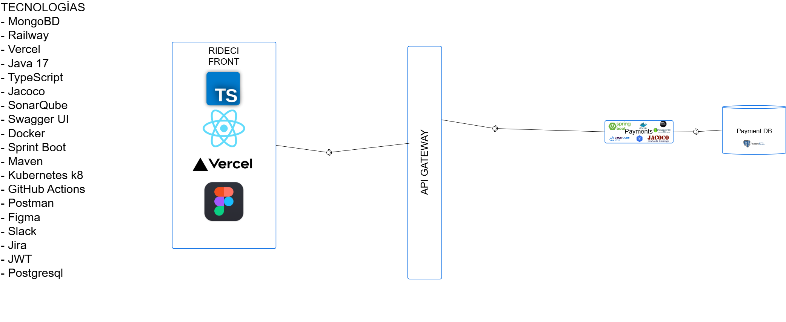
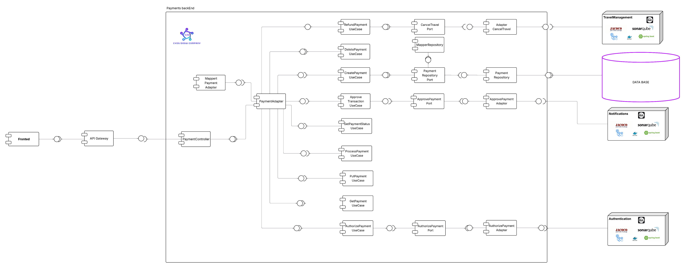
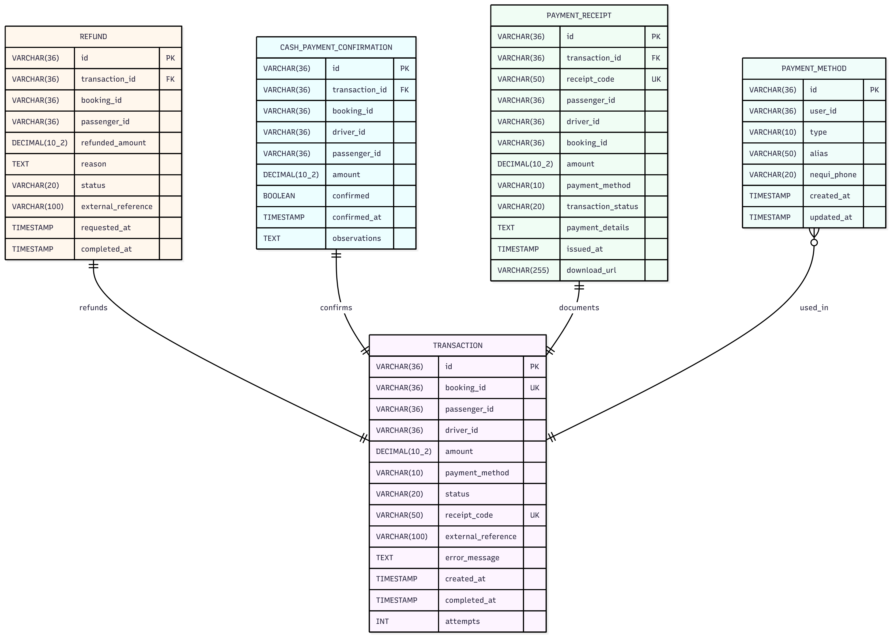

# POSEIDON_PAYMENTS

## Desarrolladores

* Deisy Lorena Guzman Cabrales
* Diego Fernando Chavarro Castillo
* Oscar Andres Sanchez Porras
* Samuel Leonardo Albarrachin Vergara
* Sergio Alejandro Idarraga

---

## Tabla de Contenidos

* [ Estrategia de Versionamiento y Branching](#-estrategia-de-versionamiento-y-branching)

  * [ Estrategia de Ramas (Git Flow)](#-estrategia-de-ramas-git-flow)
  * [ Convenciones de Nomenclatura](#-convenciones-de-nomenclatura)
  * [ Convenciones de Commits](#-convenciones-de-commits)
* [ Arquitectura del Proyecto](#-arquitectura-del-proyecto)

  * [ Estructura de Capas](#️-estructura-de-capas)
* [ Tecnologías Utilizadas](#️-tecnologías-utilizadas)
* [ Arquitectura Limpia - Organización de Capas](#️-arquitectura-limpia---organización-de-capas)
* [Diagramas del Módulo](#diagramas-del-módulo)


---

##  Estrategia de Versionamiento y Branching

Se implementa una estrategia de versionamiento basada en **GitFlow**, garantizando un flujo de desarrollo **colaborativo, trazable y controlado**.

###  Beneficios:

- Permite trabajo paralelo sin conflictos
- Mantiene versiones estables y controladas
- Facilita correcciones urgentes (*hotfixes*)
- Proporciona un historial limpio y entendible

---

##  Estrategia de Ramas (Git Flow)

| **Rama**                | **Propósito**                            | **Recibe de**           | **Envía a**        | **Notas**                      |
| ----------------------- | ---------------------------------------- | ----------------------- | ------------------ | ------------------------------ |
| `main`                  | Código estable para PREPROD o Producción | `release/*`, `hotfix/*` | Despliegue         | Protegida con PR y CI exitoso  |
| `develop`               | Rama principal de desarrollo             | `feature/*`             | `release/*`        | Base para integración continua |
| `feature/*`             | Nuevas funcionalidades o refactors       | `develop`               | `develop`          | Se eliminan tras el merge      |
| `release/*`             | Preparación de versiones estables        | `develop`               | `main` y `develop` | Incluye pruebas finales        |
| `bugfix/*` o `hotfix/*` | Corrección de errores críticos           | `main`                  | `main` y `develop` | Parches urgentes               |

---

##  Convenciones de Nomenclatura

### Feature Branches

```
feature/[nombre-funcionalidad]-hades_[codigo-jira]
```

**Ejemplos:**

```
- feature/authentication-module-hades_23
- feature/security-service-hades_41
```

**Reglas:**

*  Formato: *kebab-case*
*  Incluir código Jira
*  Descripción breve y clara
*  Longitud máxima: 50 caracteres

---

### Release Branches

```
release/[version]
```

**Ejemplos:**

```
- release/1.0.0
- release/1.1.0-beta
```

---

### Hotfix Branches

```
hotfix/[descripcion-breve-del-fix]
```

**Ejemplos:**

```
- hotfix/fix-token-expiration
- hotfix/security-patch
```

---

## Convenciones de Commits

### Formato Estándar

```
[codigo-jira] [tipo]: [descripción breve de la acción]
```

**Ejemplos:**

```
45-feat: agregar validación de token JWT
46-fix: corregir error en autenticación por roles
```

---

### Tipos de Commit

| **Tipo**   | **Descripción**                      | **Ejemplo**                                     |
| ----------- | ------------------------------------ | ----------------------------------------------- |
| `feat`      | Nueva funcionalidad                  | `22-feat: implementar autenticación con JWT`    |
| `fix`       | Corrección de errores                | `24-fix: solucionar error en endpoint de login` |
| `docs`      | Cambios en documentación             | `25-docs: actualizar README con nuevas rutas`   |
| `refactor`  | Refactorización sin cambio funcional | `27-refactor: optimizar servicio de seguridad`  |
| `test`      | Pruebas unitarias o de integración   | `29-test: agregar tests para AuthService`       |
| `chore`     | Mantenimiento o configuración        | `30-chore: actualizar dependencias de Maven`    |


**Reglas:**

* Un commit = una acción completa
* Máximo **72 caracteres** por línea
* Usar modo imperativo (“agregar”, “corregir”, etc.)
* Descripción clara de qué y dónde
* Commits pequeños y frecuentes

---

## Arquitectura del Proyecto

El backend de **POSEIDON_PAYMENTS** sigue una **arquitectura limpia y desacoplada**, priorizando:

* Separación de responsabilidades
* Mantenibilidad
* Escalabilidad
* Facilidad de pruebas

---

## Estructura de Capas

```
📂 POSEIDON_PAYMENTS
 ┣ 📂 src/
 ┃ ┣ 📂 main/
 ┃ ┃ ┣ 📂 java/
 ┃ ┃ ┃ ┗ 📂 edu/dosw/rideci/
 ┃ ┃ ┃   ┣ 📄 POSEIDON_PAYMENTS.java
 ┃ ┃ ┃   ┣ 📂 domain/
 ┃ ┃ ┃   ┃ ┗ 📂 model/           
 ┃ ┃ ┃   ┃    ┗ 📂 enums/  
 ┃ ┃ ┃   ┃ ┗ 📂 service/  
 ┃ ┃ ┃   ┣ 📂 application/
 ┃ ┃ ┃   ┃ ┣ 📂 port/
 ┃ ┃ ┃   ┃ ┃ ┣ 📂 in/          
 ┃ ┃ ┃   ┃ ┃ ┗ 📂 out/        
 ┃ ┃ ┃   ┃ ┣ 📂 events/
 ┃ ┃ ┃   ┃ ┗ 📂 mapper/        
 ┃ ┃ ┃   ┃ ┗ 📂 service/ 
 ┃ ┃ ┃   ┣ 📂 exceptions/
 ┃ ┃ ┃   ┣ 📂 infrastructure/
 ┃ ┃ ┃   ┃ ┗ 📂 adapters/
 ┃ ┃ ┃   ┃ ┃   ┗ 📂 persistence/ 
 ┃ ┃ ┃   ┃ ┗  📂 configs/
 ┃ ┃ ┃   ┃ ┗ 📂 controller/   
 ┃ ┃ ┃   ┃ ┃  ┃  ┗ 📂 dto/ 
 ┃ ┃ ┃   ┃ ┃  ┃  ┃  ┗ 📂 Request/ 
 ┃ ┃ ┃   ┃ ┃  ┃  ┃  ┗ 📂 Response/ 
 ┃ ┃ ┃   ┃ ┗ 📂 exceptions/
 ┃ ┃ ┃   ┃ ┗ 📂 persistence/ 
 ┃ ┃ ┃   ┃ ┃  ┃  ┗ 📂 Entity/ 
 ┃ ┃ ┃   ┃ ┃  ┃  ┗ 📂 Repository/ 
 ┃ ┃ ┃   ┃ ┃  ┃   ┗ 📂 mapper/ 
 ┃ ┃ ┗ 📂 resources/
 ┃ ┃   ┗ 📄 application.properties
 ┣ 📂 test/
 ┃ ┣ 📂 java/
 ┃ ┃ ┗ 📂 edu/dosw/rideci/POSEIDON_PAYMENTS/
 ┃ ┃   ┗ 📄  PoseidonPaymentsApplicationTests.java
 ┣ 📂 docs/
 ┣ 📄 pom.xml
 ┣ 📄 mvnw / mvnw.cmd
 ┗ 📄 README.md
```

---

## Tecnologías Utilizadas

| **Categoría**              | **Tecnologías**                           |
| -------------------------- | ----------------------------------------- |
| **Backend**                | Java 17, Spring Boot, Maven               |
| **Base de Datos**          | MongoDB, PostgreSQL                       |
| **Infraestructura**        | Docker, Kubernetes (K8s), Railway, Vercel |
| **Seguridad**              | JWT, Spring Security                      |
| **Integración Continua**   | GitHub Actions, Jacoco, SonarQube         |
| **Documentación y Diseño** | Swagger UI, Figma                         |
| **Comunicación y Gestión** | Slack, Jira                               |
| **Testing**                | Postman                                   |

---

## Arquitectura Limpia - Organización de Capas

### DOMAIN (Dominio)

Representa el **núcleo del negocio**, define **qué hace el sistema, no cómo lo hace**.
Incluye entidades, objetos de valor, enumeraciones, interfaces de repositorio y servicios de negocio.

### APPLICATION (Aplicación)

Orquesta la lógica del negocio a través de **casos de uso**, **DTOs**, **mappers** y **excepciones personalizadas**.

### INFRASTRUCTURE (Infraestructura)

Implementa los **detalles técnicos**: controladores REST, persistencia, configuración, seguridad y conexión con servicios externos.

---

## Diagramas del Módulo


## Diagrama de Contexto


---

### Diagrama de Despliegue


Este diagrama muestra la arquitectura de despliegue del sistema RIDECl, incluyendo la comunicación entre el cliente, los servicios backend, la base de datos y las herramientas CI/CD que soportan el ciclo de desarrollo.


#### Cliente (Front-End)

El cliente es una aplicación web desarrollada con:

- **React**
- **TypeScript**

Se comunica con el sistema mediante:

- **HTTPS (API Gateway)**
- **WebSockets** para actualizaciones en tiempo real.


#### **Payments**
Funciones principales:
- Gestión de pagos  
- Manejo de transacciones  
- Alertas emergentes  
- Reportes  
- Comunicación con otros módulos  

Tecnologías internas:
- **Spring Boot**
- **Jacoco** (cobertura de código)
- **SonarQube** (análisis de calidad)
- **Docker**

Este servicio actúa como nodo central, recibiendo solicitudes del cliente y coordinando operaciones con otros microservicios.


####  Microservicios Externos Conectados

**a) Autenticación (Usuarios)**
Maneja:
- Validación de credenciales  
- Autorización  
- Tokens y seguridad  

**b) Gestión de Viajes (Viajes)**
Responsable de la lógica de:
- Creación de viajes  
- Actualización de estados  
- Control de rutas o trayectos  

**c) Notificaciones (Email / App)**
Encargado de:
- Envío de correos  
- Envío de alertas y notificaciones internas  

Todos se comunican con el servicio Payments para ejecutar tareas específicas.


#### Base de Datos — MySQL

El servicio Payments se conecta a **MySQL** para almacenar información financiera.

Datos almacenados:
- Monto  
- Método de pago  
- Estado  
- Fecha de pago  
- Transacción  
### Diagrama de Componentes General



Este diagrama representa la arquitectura de componentes utilizada en el sistema, mostrando cómo interactúan el frontend, el API Gateway, los microservicios y las bases de datos, así como las tecnologías involucradas en cada parte.

#### Frontend (RIDECI FRONT)
El frontend está desarrollado con:

- **TypeScript**
- **React**
- Desplegado en **Vercel**
- Prototipado en **Figma**

Este módulo se comunica directamente con el **API Gateway** para solicitar datos y ejecutar acciones dentro del sistema.

#### API Gateway
El **API Gateway** actúa como punto de entrada único para todas las solicitudes provenientes del frontend. 

#### Microservicio de Payments
Se encarga de gestionar todo lo relacionado con pagos y operaciones financieras dentro del sistema.

Este microservicio se conecta directamente a la base de datos de pagos.


####  Base de Datos — Payment DB
Base de datos implementada en:

**PostgreSQL** 

PostgreSQL garantiza que cada transacción:

- se completa toda o no se ejecuta nada (atomicidad)

- no deja datos corruptos (consistencia)

- no interfiere con otras transacciones simultáneas (aislamiento)

- se guarda incluso si hay fallos de energía o del sistema (durabilidad)

Esto evita pérdida de dinero, pagos duplicados o estados incorrectos.


---

### Diagrama de Componentes Específico



El microservicio de pagos está construido bajo los principios de Clean Architecture, lo que garantiza bajo acoplamiento, alta cohesión, escalabilidad y facilidad de mantenimiento.
El siguiente diagrama representa los componentes y relaciones internas y externas del sistema.

#### Controllers
El **PaymentController** actúa como punto de entrada.
Sus responsabilidades son:
- Recibir solicitudes HTTP desde el API Gateway.
- Validar entradas básicas.
- Delegar las operaciones a los casos de uso correspondientes.
- Devolver respuestas adecuadas al cliente.
#### Use Cases (Casos de Uso)
Cada caso de uso contiene la lógica del dominio y representa una acción de negocio concreta:
- **RefundPaymentUseCase:** Maneja reembolsos ante novedades o cancelaciones en viajes.
- **AuthorizePaymentUseCase:** Valida identidad del usuario antes de operar con pagos.
- **GetPaymentUseCase:** Obtiene información detallada de un pago.
- **PutPaymentUseCase:** Actualiza un pago existente.
- **ProcessPaymentUseCase:** Orquesta el procesamiento completo de un pago.
- **GetPaymentStatusUseCase:** Consulta el estado actual del pago.
- **CreatePaymentUseCase:** Registra un nuevo pago en el sistema.
- **DeletePaymentUseCase:** Elimina pagos no definitivos.
- **ApprovePaymentUseCase:** Una vez aprobado, genera una notificación hacia servicios externos.


---
#### **MapperPaymentAdapter**
Este componente transforma objetos entre capas:
- Entidades de dominio: DTOs
- Entidades: Modelos de la base de datos
- Estructuras internas: Estructuras externas

Permite mantener un dominio limpio sin depender de formatos externos.
#### Ports y Adapters
**Ports**:
Interfaces definidas dentro de la capa de dominio que especifican *qué* necesita el caso de uso del exterior.
No contienen lógica técnica.
El diagrama incluye:
- **PaymentRepositoryPort**
- **ApprovePaymentPort**
- **AuthorizePaymentPort**
- **CancelTravelPort**

**Adapters**:
Implementaciones concretas que cumplen con los Ports:
- **PaymentRepository:** Acceso real a la base de datos MySQL.
- **AdapterApprovePayment:** Comunicación con microservicio de Notificaciones.
- **AdapterAuthorizePayment:** Integración con el microservicio de Autenticación.
- **AdapterCancelTravel:** Comunicación con microservicio de Gestión de Viajes.
- **PaymentAdapter (central):** Orquestador que coordina interacciones entre los casos de uso y los adaptadores.
Los adapters permiten reemplazar tecnologías externas sin modificar la capa de dominio.
### Repositorio
### **PaymentRepository**
Implementa el PaymentRepositoryPort y se encarga de:
- Guardar pagos
- Consultar pagos
- Actualizar pagos
- Eliminar registros

Es una parte de la capa de infraestructura.

#### Conexiones Externas
**1. Microservicio de Notificaciones**:
Utilizado para enviar notificaciones cuando un pago es aprobado.

**2. Microservicio de Gestión de Viajes**:
Se usa en operaciones como cancelación de viaje o reembolso.

**3. Microservicio de Autenticación**:
Valida la identidad del usuario antes de autorizar operaciones.

**4. Base de Datos MySQL**:
Almacena toda la información transaccional de pagos:

---

## Diagrama de Casos de Uso


---

### Diagrama de Clases


---

### Diagrama de Bases de Datos



---
